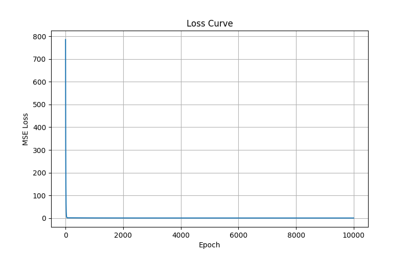
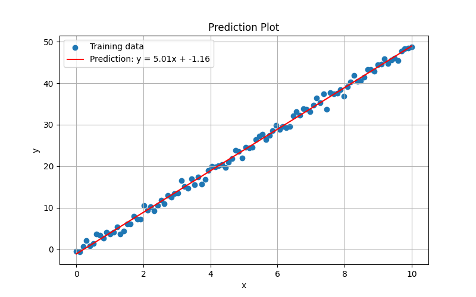

# NumPy 手写线性回归

这是我的第一个 AI 学习项目：使用 NumPy 从零实现一元线性回归，并用梯度下降学习直线参数。

项目没有使用 `scikit-learn` 等机器学习库来训练模型，而是手写了预测、损失函数、梯度计算和参数更新过程。目标是理解机器学习训练循环的核心逻辑：

```text
预测 -> 计算损失 -> 计算梯度 -> 更新参数
```

## 项目目标

本项目要学习的问题是：

```text
y = wx + b
```

其中：

- `x` 是输入数据
- `y` 是真实结果
- `w` 是权重，也就是直线斜率
- `b` 是偏置，也就是直线截距

模型的目标是通过训练学出接近真实规律的 `w` 和 `b`。

## 方法原理

训练数据由下面的规则生成：

```text
y = 5x - 1 + noise
```

其中 `noise` 是随机噪声，用来模拟真实数据中的误差。

模型一开始设置：

```text
w = 0
b = 0
```

每一轮训练都会计算预测值：

```text
y_pred = wx + b
```

然后使用均方误差作为损失函数：

```text
loss = mean((y_pred - y)^2)
```

接着计算 `w` 和 `b` 的梯度：

```text
dw = mean(2 * (y_pred - y) * x)
db = mean(2 * (y_pred - y))
```

最后用梯度下降更新参数：

```text
w = w - learning_rate * dw
b = b - learning_rate * db
```

## 项目结构

```text
.
├── train.py
├── requirements.txt
├── src/
│   ├── data.py
│   ├── model.py
│   └── visualize.py
└── outputs/
    ├── loss_curve.png
    └── prediction_plot.png
```

各文件作用：

- `train.py`：项目入口，负责生成数据、训练模型、保存图片
- `src/data.py`：生成带噪声的线性数据
- `src/model.py`：实现预测、MSE loss、梯度计算和训练循环
- `src/visualize.py`：使用 Matplotlib 画图
- `outputs/`：保存训练结果图片

## 如何运行

创建虚拟环境：

```powershell
python -m venv .venv
```

激活虚拟环境：

```powershell
.\.venv\Scripts\Activate.ps1
```

安装依赖：

```powershell
pip install -r requirements.txt
```

运行训练：

```powershell
python train.py
```

## 实验结果

当前训练设置：

```text
learning_rate = 0.001
epochs = 10000
```

训练后模型学到的结果约为：

```text
y = 5.0118x - 1.1597
```

真实规律是：

```text
y = 5.0000x - 1.0000
```

由于数据中加入了随机噪声，所以模型学到的参数不会和真实参数完全一致，但已经非常接近。

## 可视化结果

Loss 曲线：



预测结果：



## 我学到了什么

- 线性回归可以用梯度下降训练。
- MSE 可以衡量预测值和真实值之间的平均误差。
- 梯度表示 loss 对参数变化的敏感程度。
- 负梯度方向是让 loss 下降的方向。
- 学习率太小会导致训练很慢。
- 学习率太大可能导致训练发散，甚至出现 `nan`。
- NumPy 可以用向量化方式同时处理很多数据点。
- Matplotlib 可以帮助我们可视化训练过程和预测结果。

## 下一步

- 使用 `scikit-learn` 的 `LinearRegression` 做对照实验。
- 扩展到多元线性回归。
- 给 `learning_rate` 和 `epochs` 增加命令行参数。
- 为 loss 和梯度计算补充简单测试。
